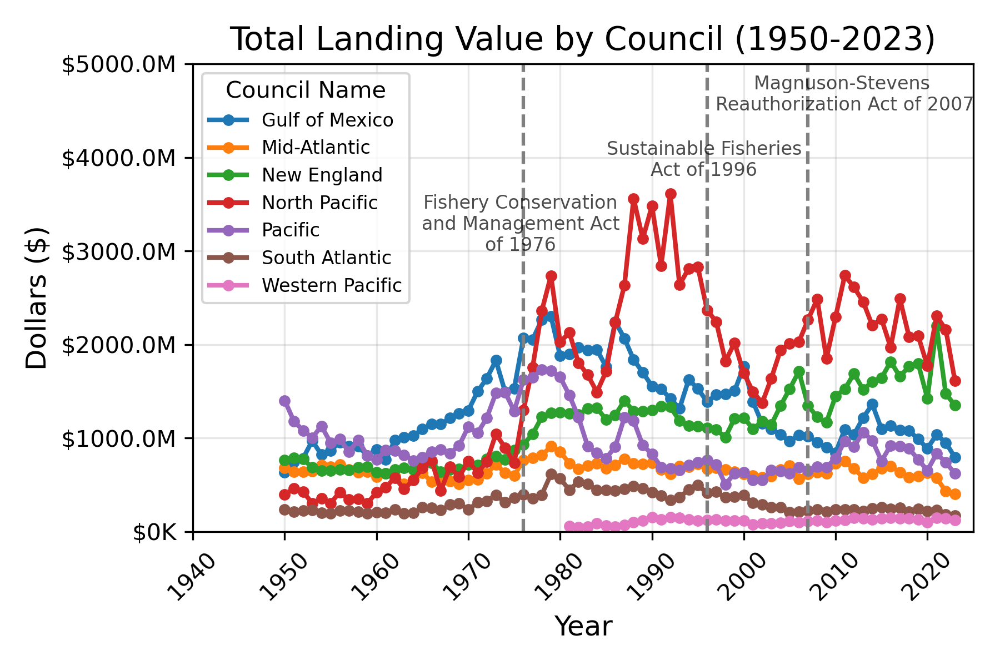
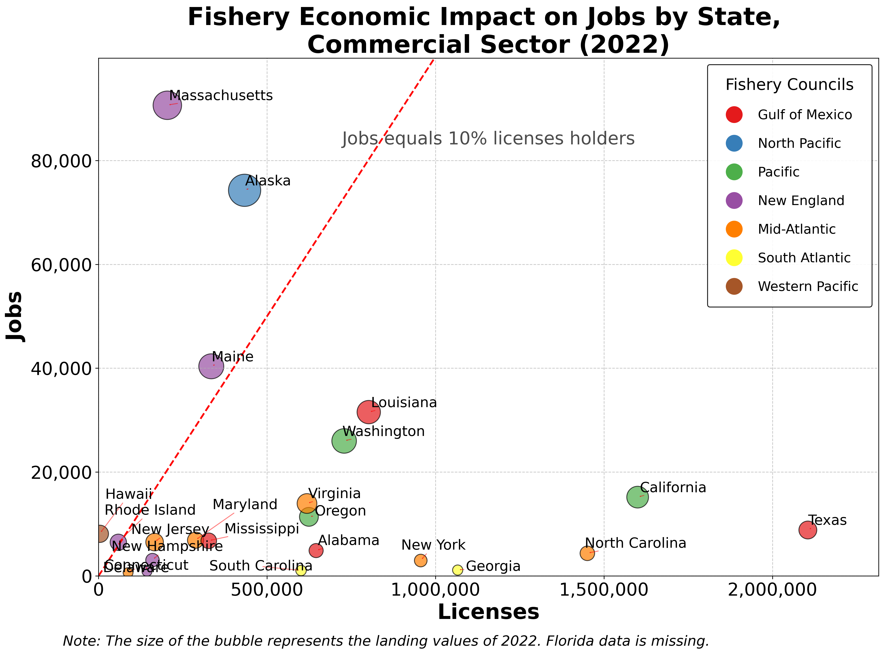

# U.S. Fishery Management: Legislative Milestones and Economic Impact
## I. Summary
The U.S. fishing industry, valued at approximately $200 billion, operates under a complex management system established in 1976. Eight regional Fishery Management Councils (FMCs) govern federal waters, bringing together diverse stakeholders to balance economic interests with resource sustainability. Three major legislative acts have shaped this system: the 1976 Fishery Conservation and Management Act established the council system; the 1996 Sustainable Fisheries Act mandated comprehensive management plans; and the 2007 Magnuson-Stevens Reauthorization Act required science-based decision-making. This project evaluates the impact of these regulations by analyzing three metrics: total landing values (1950-2023), fishing license holders, and job creation in commercial and recreational sectors. By examining the relationship between these metrics and legislative milestones, this study reveals how regulations have shaped the industry and how economic impacts vary regionally.

## II. Background
Fishing is a $200 billion industry in the United States. The fishery resources in federal waters are managed through eight regional Fishery Management Councils (FMCs). They are: *New England Fishery Management Council*, *Mid-Atlantic Fishery Management Council*, *South Atlantic Fishery Management Council*, *Caribbean Fishery Management Council*, *Gulf of Mexico Fishery Management Council*, *Pacific Fishery Management Council*, *Western Pacific Fishery Management Council*, and *North Pacific Fishery Management Council*. They were established in 1976 with the passage of the Magnuson-Stevens Act (MSA). Each FMC is responsible for a range of regional management tasks, including developing fishery management plans, convening committees and advisory panels, conducting public meetings, establishing research priorities, selecting management options, setting annual catch limits based on the best available science, and developing and implementing rebuilding plans. Typically, each council consists of 13 to 18 members, split between appointed members and designated state/federal members, who come from diverse educational, affiliation, and fishery experience backgrounds. They meet every 3 months per year to discuss amendments to fishery management plans.

The regulatory framework for U.S. fisheries has evolved through three major legislative acts. The **Fishery Conservation and Management Act of 1976** established the council system, creating a regionalized approach to fishery governance. The **Sustainable Fisheries Act of 1996** strengthened conservation efforts by requiring councils to develop comprehensive fishery management plans. The **Magnuson-Stevens Reauthorization Act of 2007** further enhanced the system by mandating science-based decision-making processes in policy development.

To evaluate the impact of these regulations, we can look at total landings value and total number of paid fishing license holders. Total landing values reflect the cash value of all fishery resources. This allows us to evaluate the extensiveness of harvesting activities. The total number of paid fishing license holders reflects the size of the fishing population and community. This allows us to evaluate how many people can be potentially affected by the policies that regulate fishing activities.

To compare all eight fishery management councils, we can look at the total jobs created compared with the total number of fishing license holders. The data is only available for the year 2022. The total jobs created by commercial and recreational sectors can allow us to evaluate the impact of fishery policies.

## III. Input Data
The fish licenses data:
- link: https://us-east-1.quicksight.aws.amazon.com/sn/accounts/329180516311/dashboards/602cf050-6e11-4da5-9917-7229fd08648b?directory_alias=tracs-quicksight
- The file is downloaded as `Table_B._License_Hol_1743473324110.csv`

The council governing area data:
- Fishery management area: https://services2.arcgis.com/C8EMgrsFcRFL6LrL/arcgis/rest/services/fishery_management_council_regions_20210609/FeatureServer
- This data will be directly imported in QGIS with the link above. The steps are: Layer –> Add Layer –> Add ArcGIS REST Server Layer –> Insert the link above

State and State equivelent FIPS data:
- Link: https://www2.census.gov/geo/docs/reference/codes2020/national_state2020.txt
- The file is downloaded as `national_state2020.txt`

Fishery landing and economic impact data:
- FOSS: https://www.fisheries.noaa.gov/foss/f?p=215:200::::::
- The historical landing value data is downloaded as `FOSS_landings.csv`. The landing value is adjusted for inflation. The baseline year is 2023.
- The economic impact data for commercial sector is downloaded as `commercial_impact_state.csv`
- The economic impact data for recreational sector is downloaded as `recreational_impact_state.csv`

The Consumer Price Index for All Urban Consumers (CPI-U) data:
- Link: https://data.bls.gov/pdq/SurveyOutputServlet
- The data is downloaded as `SeriesReport-20250503122118_127e15.xlsx`

U.S. state boundary data
- TIGER/Line shapefile. The year is `2019` and layer type is `State and State equivelent`
- Link: https://www.census.gov/cgi-bin/geo/shapefiles/index.php

The council and state mapping data:
- created by the author with `fips_council_mapping.csv`

## IV. Application of GIS
By combining the state boundary data using `data_col_join.py`, we have created the `licenses.gpkg` file. By importing this data into QGIS and using the ArcGIS map of council areas, I have generated a visualization of each council's governing area as shown below. 

## V. Analysis
First, the overall trend of total landing value from 1950 to 2023 by council is shown below. The codes for this analysis are `data_col_landing.py`, `data_col_council.py` and `ana_trend.py`. In 1976, after the establishment of the fishery management councils by the Fishery Conservation and Management Act, the total landing values increased immediately for the next three years across all councils. After that, some councils experienced a decrease in the total landing value, such as North Pacific FMC and Pacific FMC, while some councils experienced a relatively stable or even increasing trend in landing values, such as Gulf of Mexico FMC, New England FMC, South Atlantic FMC, and Mid-Atlantic FMC. However, the total landing value of North Pacific FMC increased drastically after 1981, leading to the passage of the Sustainable Fisheries Act of 1996, which required councils to develop fishery management plans as the main policy output to govern fishing activities. After the passage of this law, the total landing value of fish was maintained at a relatively stable level. In 2007, the Magnuson-Stevens Reauthorization Act was passed. After that, the total landing value increased a little then became relatively stable. The total landing values from highest to lowest are: North Pacific FMC, New England FMC, Gulf of Mexico FMC, Pacific FMC, Mid-Atlantic FMC, South Atlantic FMC, and Western Pacific FMC. 

Second, the total number of paid fishing license holders is shown below. The codes for this analysis are `data_col_licenses.py`, `data_col_council.py` and `ana_trend.py`. Over the years, the number of total paid fishing license holders for all councils is relatively stable, with the highest levels in Pacific FMC and Mid-Atlantic FMC, which each have about 3M paid fishing license holders. One interesting change over the years is that the fishing population (measured as the total number of fishing license holders) of Pacific FMC decreased slightly after the Sustainable Fisheries Act of 1996, while the fishing population of Mid-Atlantic FMC increased after that. Meanwhile, the fishing population of Gulf of Mexico FMC continued to increase after the passage of the Magnuson-Stevens Reauthorization Act of 2007, making it the council with the second largest fishing population in 2025. 

Third, the comparison of fishing population and jobs created in the commercial sectors is shown below. The codes for this analysis are in `data_col_licenses.py`, `data_col_council.py` and `ana_com_imp.py`. The graph shows that there are big differences among states within or across councils in terms of economic impact of fishery policies. Specifically, Massachusetts, Alaska, Maine, and Hawaii created commercial fishing jobs representing more than 10% of their total fishing population. 

Finally, the comparison of fishing population and jobs created in the recreational sector is shown below. The codes for this analysis are `data_col_licenses.py`, `data_col_council.py` and `ana_rec_impact.py`. The graph highlights that Florida has created a large number of recreational jobs, which is about 37,500 in 2022. Other states create a relatively lower number of jobs. In terms of differences among councils, New England FMC created relatively more jobs in the commercial sector, but relatively fewer in the recreational sector. 

## VI. Conclusion
This project has provided valuable insights into the evolution of legislative milestones and economic impacts of U.S. fishery management through an analysis of landing values, fish populations, and job creation across different regions and time periods. The findings demonstrate that the three major legislative acts—the Fishery Conservation and Management Act of 1976, the Sustainable Fisheries Act of 1996, and the Magnuson-Stevens Reauthorization Act of 2007—were followed by significant changes in fishing activities and outcomes, suggesting that policy interventions have played an important role in shaping the industry.

The analysis revealed considerable regional variation in how fishery resources contribute to local economies. States like Massachusetts, Alaska, Maine, and Hawaii have developed robust commercial fishing sectors, with commercial fishing jobs representing more than 10% of their total fishing population. In contrast, Florida has emerged as a leader in recreational fishing, generating approximately 37,500 jobs in this sector. These patterns highlight how different regions have developed specialized niches within the broader fishing industry, likely influenced by a combination of geographic advantages, historical practices, and policy decisions.

As fishery management continues to evolve, these findings underscore the importance of considering regional differences when developing policies. The varying economic structures across councils suggest that one-size-fits-all approaches may be less effective than targeted strategies that recognize the unique characteristics and needs of each region. Future research could explore how specific management practices within each council have contributed to these regional differences and identify best practices that could be shared across regions to enhance both economic outcomes and resource sustainability throughout the U.S. fishing industry.